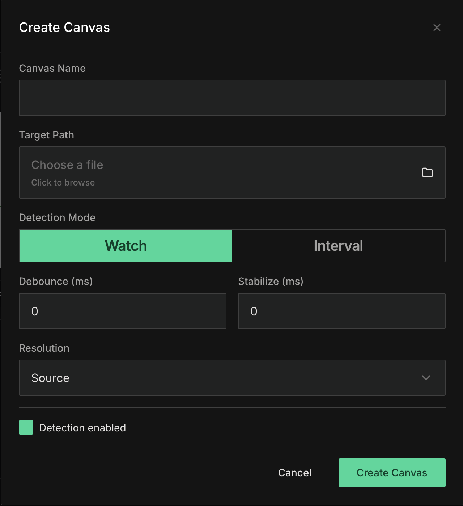
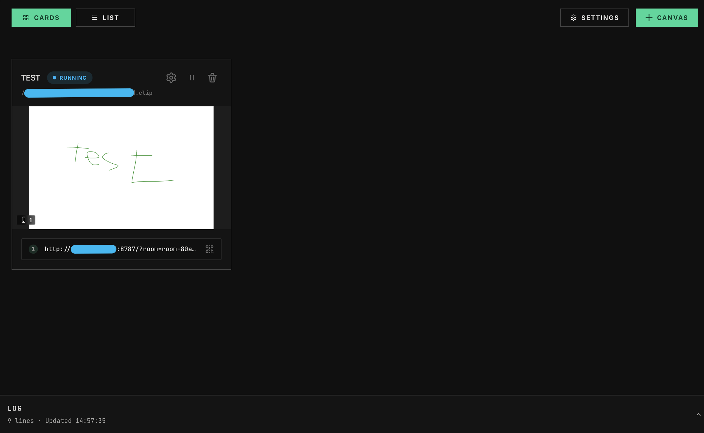
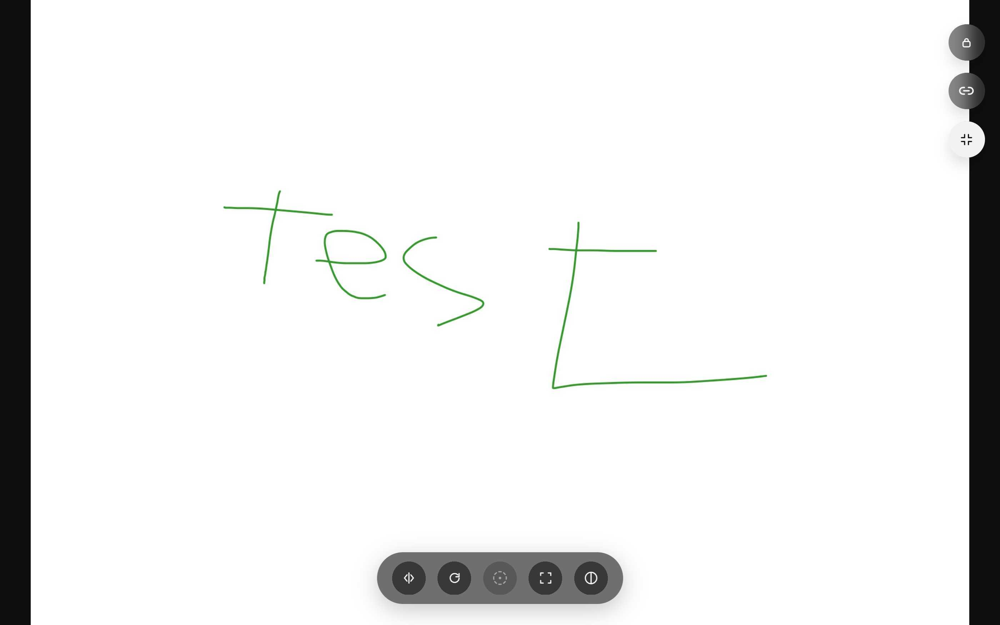

# Canvas Mirror

> Warning
> Canvas Mirror uses plain HTTP/WS by default. Do not use sensitive data or images over public or shared networks unless you put it behind HTTPS/WSS.

> macOS note
> The GitHub release build for macOS is ad-hoc signed, but it is not notarized. Gatekeeper may still show a security warning, and users may need to open the app manually from Privacy & Security.

Mirror illustration previews to another screen over your local network.

Canvas Mirror watches a source file, generates a preview image, and streams it to a lightweight viewer over WebSocket.

## Components

- `canvas-mirror`: CLI runtime and local transport host
- `Canvas Mirror Viewer`: browser-based viewer UI
- `Canvas Mirror Studio`: desktop app for creating, managing, and sharing canvases

## Canvas Mirror Studio

Canvas Mirror Studio lets you create a canvas from a local file, watch for changes, and share a viewer link to another screen. The Studio app manages canvases, while the browser viewer provides a clean fullscreen display for the mirrored result.

### What you can do

- Create a canvas from a target file
- Choose detection mode, debounce and stabilize timing, and output resolution
- Monitor running canvases from the Studio dashboard
- Share a viewer link or QR code with another device
- Open the browser viewer for a fullscreen mirrored preview

### Screenshots

#### Create canvas



#### Studio dashboard



#### Viewer



### macOS release note

The macOS release build is distributed with ad-hoc signing to reduce "app is damaged" style errors, but it is still not notarized. On first launch, macOS may show a security warning such as "developer cannot be verified".

If Gatekeeper blocks the app, open it from `System Settings > Privacy & Security`, or remove the quarantine attribute manually:

```bash
xattr -dr com.apple.quarantine "/Applications/Canvas Mirror Studio.app"
open "/Applications/Canvas Mirror Studio.app"
```

## CLI

The `canvas-mirror` CLI runs the local transport host and manages persisted rooms from the terminal.

### Run the server

```bash
cargo run -p canvas-mirror -- serve
```

Use a custom config path when needed.

```bash
cargo run -p canvas-mirror -- --config ./canvas-mirror-config.toml serve
```

When the server starts, it prints the resolved viewer URLs, WebSocket endpoints, room links, QR links, and security warnings. Runtime logs are also written under `./logs/`.

### Example config

```toml
bind_addr = "127.0.0.1:8787"
store_path = "./canvas-mirror-store.toml"
stale_timeout_ms = 30000

# Optional
# public_url = "https://viewer.example.com/canvas-mirror/"
# viewer_path = "./apps/canvas-mirror-viewer/index.html"
```

### Useful commands

Print the current runtime status:

```bash
cargo run -p canvas-mirror -- status
```

List persisted rooms:

```bash
cargo run -p canvas-mirror -- room list
```

Create a room:

```bash
cargo run -p canvas-mirror -- room create \
  --id room-test \
  --name "Test Canvas" \
  --target-path ./sample.clip \
  --mode watch \
  --resolution source
```

Update a room:

```bash
cargo run -p canvas-mirror -- room update \
  --id room-test \
  --name "Updated Canvas" \
  --mode interval \
  --interval-ms 2000
```

Delete a room:

```bash
cargo run -p canvas-mirror -- room delete --id room-test
```
